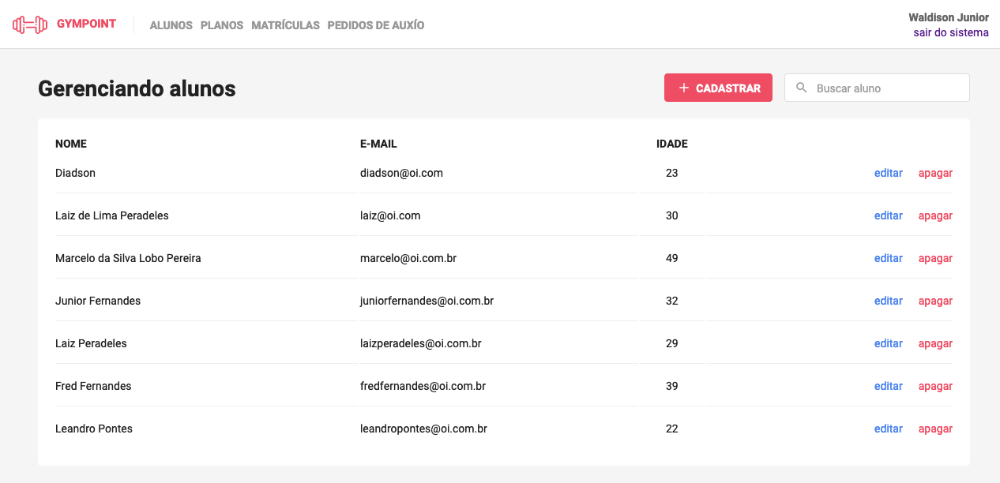

<h1 align="center">
  
</h1>

<h3 align="center">
  Gympoint - Desafio Final - Bootcamp 2019
</h3>

## PROCEDIMENTOS PARA INSTALAÇÃO

Clonar o repositorio

### Backend

1. Entrar no diretorio `backend` e rodar `yarn` para instalar as libs utilizadas no projeto;
2. Altere o arquivo `.env.example` para `.env`;
3. Execute as seeds do projeto;
4. Rode `yarn dev` para executar o servidor backend;

### Frontend

1. Entrar no diretorio `frontend` e rodar `yarn` para instalar as libs utilizadas no projeto;
2. Rode `yarn start` para executar a aplicação web

Dados para acessar a aplição web: 
Usuario: `waldisonjunior@oi.com.br`
Senha: `987654321`

  

  

### Mobile

**APP TESTADO SOMENTE NO IOS!**

1. Entre no diretorio `mobile` e rodar `yarn` para instalar as libs utilizadas no projeto;
2. Entre no diretorio `ios` e rode `pod install`;
3. Rertorne a pasta depois da instalação e execute o comando `react-native ruin-ios`;
4. Faça o login com o id `1`;

  

  

  

  

  

